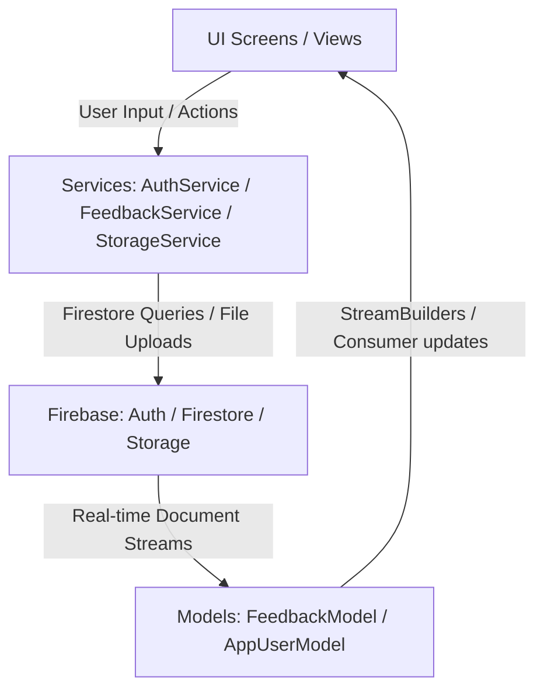

# Feedback_Review 🌟

[](https://flutter.dev)
[](https://firebase.google.com)
[](#)
[](#)

A beautiful, production-ready **Public Feedback and Review Feed application** built using **Flutter** and backed by **Firebase**.

Users can post reviews with star ratings, write comments, categorize their feedback, and upload photographic evidence. Admins have access to a secure, real-time statistics dashboard with interactive data charts, moderation controls, and CSV reporting options.

---

## 🏗️ Architecture & Data Flow

The application is structured using a service-oriented architecture powered by `Provider` for state management and dependency injection. This ensures a clean separation of concerns:



### State Management & Streams
*   **Decoupled Services**: UI views interact solely with `AuthService`, `FeedbackService`, and `StorageService`. Direct Firebase API calls are banned inside screens.
*   **Real-time Synchronization**: Feed views rely entirely on `StreamBuilder` connected to Firestore query streams. This facilitates instant UI updates when additions, edits, or status moderations occur.
*   **Local Processing**: To optimize reads and eliminate extra database indexing constraints, text searches and category filters are computed in local memory using Dart's collection operations on the active stream snapshot.

---

## 🚀 Key Features

### 👤 User Capabilities
*   **Secure Authentication**: Email & Password registration and login via *Firebase Auth*.
*   **Public Feed**: A real-time, public stream of feedback submissions, complete with circular initials avatars, rating indicators, and category tags.
*   **Categorization**: Organizes submissions into five specific chips: `Bug`, `Feature`, `Praise`, `Complaint`, or `General`.
*   **Media Attachments**: Camera/Gallery image picker upload utilities backed by *Firebase Storage*.
*   **Ownership Management**: Contextual dropdown menus allowing users to *Edit* or *Delete* their own submissions before reviews occur.
*   **Global Light/Dark Mode**: A manual theme toggle on the profile screen that adapts the theme instantly using `ThemeProvider`.

### 🛡️ Administrative (Admin) Privileges
*   **Notification Badges**: Real-time counter badge on the navigation bar showcasing new feedback submissions since the admin's `lastDashboardVisit` timestamp.
*   **Interactive Dashboard**:
    *   **Aggregate Analytics**: Cards showing Total Reviews, Average Rating, Submissions This Week, and Open vs. Reviewed counts.
    *   **fl_chart Visualizations**: An interactive Bar Chart displaying rating distributions from 1★ to 5★.
    *   **Moderation Panel**: Direct access to mark documents as reviewed, type official responses, or delete inappropriate submissions.
*   **CSV Reporting**: Converts currently filtered lists into tabular formats using the `csv` package and shares files native-to-device with `share_plus`.

---

## 🛠️ Tech Stack & Dependencies

*   **UI Framework**: Flutter (Material 3 enabled)
*   **State Management**: `provider` (MultiProvider architecture)
*   **Backend**: 
    *   *Firebase Auth* (Authentication)
    *   *Cloud Firestore* (Real-time DB)
    *   *Firebase Storage* (Asset Uploads)
*   **Key Packages**:
    *   `google_fonts` (Clean typography using *Inter*)
    *   `flutter_rating_bar` (Interactive stars selector)
    *   `shimmer` (Elegant skeleton loading states)
    *   `fl_chart` (High-performance analytical graphs)
    *   `cached_network_image` (Network cache and local image placeholder loaders)
    *   `image_picker` (Camera/Gallery capture API)
    *   `csv` (Tabular data generation)
    *   `share_plus` (System share integration)

---

## 📂 Project Architecture

The codebase follows a clean, service-oriented structure separating data representation, backend operations, and layout presentation:

```text
lib/
├── models/
│   ├── app_user_model.dart      # Holds profile, roles, and dashboard visits
│   └── feedback_model.dart      # Maps ratings, comments, photos, status, and replies
├── services/
│   ├── auth_service.dart        # Manages Auth and profile metadata updates
│   ├── feedback_service.dart    # Manages Firestore streams, updates, and replies
│   └── storage_service.dart     # Manages Firebase Storage directory uploads
├── theme/
│   ├── app_theme.dart           # Custom Indigo (#4F46E5) light and dark schemes
│   └── theme_provider.dart      # Global manual theme switcher ChangeNotifier
├── widgets/
│   └── feedback_card.dart       # Reusable Material 3 feed card with hero anchors
├── screens/
│   ├── splash_screen.dart       # Determines initial routing parameters
│   ├── login_screen.dart        # Authentication access portal
│   ├── signup_screen.dart       # Default role ("user") registration portal
│   ├── home_screen.dart         # Bottom Navigation tab navigator
│   ├── feedback_list_screen.dart# Searchable public feedback feed
│   ├── my_feedback_screen.dart  # Filtered personal user portfolio
│   ├── admin_dashboard_screen.dart # Admin panels, fl_charts, and CSV exporters
│   ├── feedback_detail_screen.dart # Hero-animated feedback inspector and moderator
│   └── profile_screen.dart      # Avatar profiles, Dark mode switch, and logouts
└── main.dart                    # App bootstrapper and MultiProvider configurations
```

---

## 🔒 Security Policy (Rules Summary)

### Cloud Firestore
*   **Profiles (`/users/{uid}`)**: Authenticated users can read profiles. Write access is restricted to the owner of the UID or admins.
*   **Submissions (`/feedback/{id}`)**: Read access is public (to support public feeds). User creation writes require `userId` matches the writer. Updates to `status` and `adminReply` are blocked for normal users (admin-only).

### Firebase Storage
*   Upload paths are isolated strictly to user directories: `/users/{userId}/feedback_photos/{fileName}`. Write access is restricted to the folder owner, while read permissions are open for the public feed.

---

## 📥 Setup and Installation

### Prerequisites
*   [Flutter SDK](https://docs.flutter.dev/get-started/install) installed (minimum SDK matching `pubspec.yaml` environment).
*   A Firebase Project initialized in your [Firebase Console](https://console.firebase.google.com).

### Step-by-Step Configuration

1.  **Clone the Repository**:
    ```bash
    git clone https://github.com/withshafan/feedback_review_app.git
    cd feedback_review_app
    ```

2.  **Add Firebase Credentials**:
    *   **Android**: Place your `google-services.json` inside `android/app/`.
    *   **iOS**: Add your `GoogleService-Info.plist` to your Xcode project directories.

3.  **Install Dependencies**:
    ```bash
    flutter pub get
    ```

4.  **Run Launcher Icon Generation**:
    ```bash
    flutter pub run flutter_launcher_icons
    ```

5.  **Run the Application**:
    ```bash
    flutter run
    ```

---

## 📄 License

This project is licensed under the MIT License - see the [LICENSE](LICENSE) file for details.
